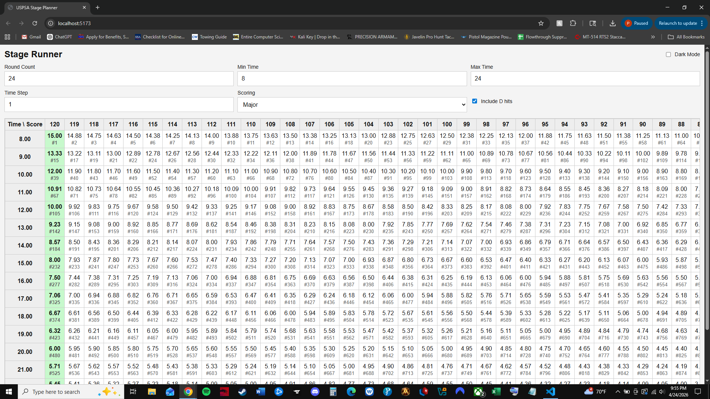

# Stage Runner Mobile Application

## Overview

Stage Runner is a mobile application designed to help competitive shooters plan and optimize stage performance. The app allows users to visualize scoring efficiency, compare strategies, and improve hit factor outcomes. This project demonstrates practical problem-solving, UI design, and application development alongside system administration skills.

---

## Features

- Hit factor calculation
- Stage performance analysis
- Interactive input system
- Responsive UI for mobile devices
- Real-time feedback for scoring optimization

---

## Technical Details

- Frontend: Web-based mobile UI
- Styling: Custom CSS (responsive layout)
- Logic: JavaScript-based calculations
- Platform: Designed for cross-platform deployment (Android / iOS)

---

## What I Built

- Designed and implemented full UI layout and styling
- Developed scoring and hit factor calculation logic
- Built responsive design for mobile usability
- Structured application for future app store deployment

---

## Screenshots

### Desktop View

### Mobile View

---

## Future Plans

- Deploy to Google Play Store
- Deploy to Apple App Store
- Add user accounts and data saving
- Improve performance analytics

---

## Note

Full source code available upon request.
